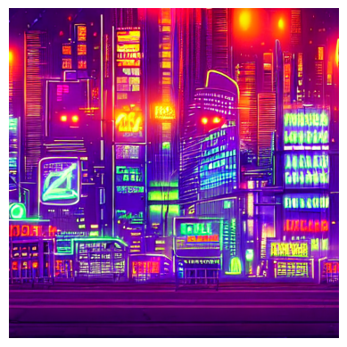

# 🧠 PRODIGY_GA_02 – Text-to-Image Generation using Stable Diffusion

This project demonstrates the use of **pre-trained generative models** to generate images from natural language prompts using **Stable Diffusion** and the Hugging Face `diffusers` library.

The notebook runs on **Google Colab** with **GPU support**, and includes support for **batch image generation** and **automatic saving of images**.

---

## ✅ Objective

> Utilize pre-trained generative models like DALL·E-mini or Stable Diffusion to create images from text prompts.

---

## 🛠️ Technologies Used

- 🤗 `diffusers`
- 🤗 `transformers`
- ⚡ `accelerate`
- 🔥 `torch` (PyTorch)
- 🧪 `scipy`
- 📊 `matplotlib`
- 💻 Google Colab with GPU runtime

---

## 📦 Model Details

- **Model**: `CompVis/stable-diffusion-v1-4`
- **Task**: Text-to-Image Generation
- **Input**: Text prompt
- **Output**: 512x512 Image
- **License**: [CreativeML Open RAIL-M](https://github.com/CompVis/stable-diffusion/blob/main/LICENSE)

---

Sure! Here's the corrected and well-formatted section of your `README.md` for the **Prompt Used**, **Output Image**, and **Notebook Link**.

---


## 🖌️ Prompt Used

```python
prompt = "a cyberpunk futuristic cityscape at night with glowing neon signss"
````

---

## 🖼️ Output

Here is the output generated by the Stable Diffusion model:



---

## 📓 View Notebook

You can view the output and code in the notebook here:
🔗 [Open with NBViewer](https://nbviewer.org/github/Parth-349/PRODIGY_GA_02/blob/main/Output.ipynb)


